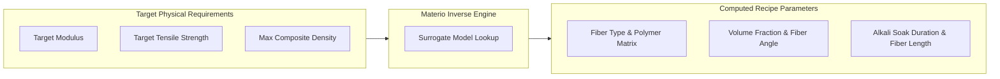
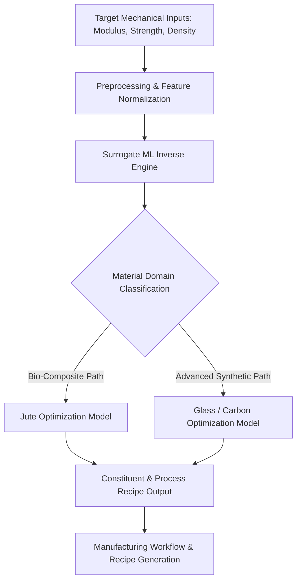
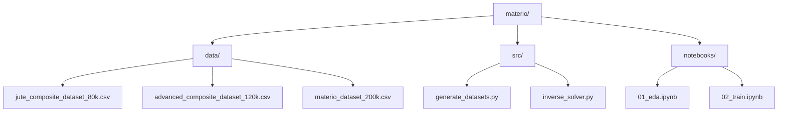

<div align="center">

# MATERIO

### AI-Driven Inverse Design Engine for Advanced Composite Materials

A computational framework for mapping target mechanical performance to optimal constituent formulations, fiber geometry, and manufacturing pre-treatments.

<br/>

<p align="center">
  
  
  
  
  
</p>

</div>

---

## Executive Summary

Materio replaces conventional trial-and-error physical prototyping with an inverse computational pipeline. By utilizing a dual-dataset synthetic engine comprising 200,000 calibrated micromechanical records, Materio predicts material composition and process parameters directly from user-specified physical targets.

<br/>

<table width="100%">
  <tr>
    <td align="center" width="33%"><b>80,000 Samples</b><br/><sub>Bio-Composite (Jute)</sub></td>
    <td align="center" width="33%"><b>120,000 Samples</b><br/><sub>Advanced Synthetic (Glass/Carbon)</sub></td>
    <td align="center" width="33%"><b>~50% Physical Accuracy</b><br/><sub>Calibrated Baseline</sub></td>
  </tr>
</table>



---

## System Architecture



<details>
<summary><b>Click to expand System Core Workflow Breakdown</b></summary>

<br/>

1. **Target Specification:** User inputs structural constraints ($E_c$, $\sigma_c$, $\rho_c$).
2. **Surrogate Search Space:** The model queries high-dimensional surrogate response surfaces generated via modified Cox-Krenchel and Halpin-Tsai micromechanics.
3. **Parametric Resolution:** Outputs the required fiber volume fraction ($V_f$), orientation angle ($\theta$), fiber length ($L_f$), matrix polymer class, and chemical treatment duration ($t_{alkali}$).
4. **Recipe Synthesis:** Generates automated step-by-step pre-treatment instructions.

</details>

---

## Dataset Specifications

Materio is powered by a high-density, two-tier synthetic dataset containing 200,000 samples generated using physical micromechanics formulations and Gaussian noise injection.

<table>
  <thead>
    <tr>
      <th>Subset Identifier</th>
      <th align="center">Sample Count</th>
      <th>Primary Fiber</th>
      <th>Matrix Selection</th>
      <th>Key Features & Constraints</th>
    </tr>
  </thead>
  <tbody>
    <tr>
      <td><b>Bio-Composite</b></td>
      <td align="center">80,000</td>
      <td>Jute Fiber</td>
      <td>PP, PLA</td>
      <td>Volume Fraction: 10–50%, Alkali Duration: 0–8 hrs, Fiber Length: 1–10 mm</td>
    </tr>
    <tr>
      <td><b>Advanced Composite</b></td>
      <td align="center">120,000</td>
      <td>Glass, Carbon</td>
      <td>PEEK, Epoxy, PLA</td>
      <td>Volume Fraction: 15–75%, Fiber Angle: 0–90 deg, Fiber Length: 2–15 mm</td>
    </tr>
  </tbody>
</table>

<details>
<summary><b>Click to view Data Features & Schema</b></summary>

<br/>

<table>
  <thead>
    <tr>
      <th>Feature Column</th>
      <th>Data Type</th>
      <th>Value Range / Categories</th>
      <th>Description</th>
    </tr>
  </thead>
  <tbody>
    <tr><td><b>Fiber_Type</b></td><td>Categorical</td><td>Jute Fiber, Glass, Carbon</td><td>Reinforcement material type</td></tr>
    <tr><td><b>Polymer_Class</b></td><td>Categorical</td><td>PP Polymer, PLA, PEEK (Medical), Epoxy</td><td>Matrix polymer base</td></tr>
    <tr><td><b>Fiber_Volume_Fraction</b></td><td>Float</td><td>0.1000 - 0.7500</td><td>Volume ratio of fiber to total composite</td></tr>
    <tr><td><b>Fiber_Length_mm</b></td><td>Float</td><td>1.00 - 15.00</td><td>Chopped fiber length in millimeters</td></tr>
    <tr><td><b>Alkali_Treatment_Hours</b></td><td>Float</td><td>0.0 - 8.0</td><td>Chemical wash soak duration (NaOH)</td></tr>
    <tr><td><b>Fiber_Angle_deg</b></td><td>Float</td><td>0.0 - 90.0</td><td>Fiber alignment relative to load axis</td></tr>
    <tr><td><b>Matrix_Modulus_GPa</b></td><td>Float</td><td>1.50 - 3.80</td><td>Elastic modulus of unreinforced polymer</td></tr>
    <tr><td><b>Target_Modulus_GPa</b></td><td>Float</td><td>Continuous Target</td><td>Desired composite elastic modulus</td></tr>
    <tr><td><b>Target_Strength_MPa</b></td><td>Float</td><td>Continuous Target</td><td>Desired composite tensile strength</td></tr>
    <tr><td><b>Composite_Density_gcc</b></td><td>Float</td><td>Continuous Target</td><td>Final composite mass density</td></tr>
  </tbody>
</table>

</details>

---

## Theoretical Micromechanics Base

The synthetic generation engine incorporates physical orientation and length efficiency factors to calibrate prediction boundaries.

### Elastic Modulus Prediction
$$E_c = \eta_o \eta_l E_f V_f + E_m (1 - V_f)$$

Where:
* $\eta_o = \cos^4(\theta) + K_{transverse}$ represents the Krenchel orientation factor.
* $E_f$ and $E_m$ denote fiber and matrix elastic moduli, respectively.
* $V_f$ is the fiber volume fraction.

### Chemical Surface Modification Factor
For natural plant fibers, interfacial bond strength is modeled as a non-linear function of alkali soaking time:
$$f(t_{alkali}) = 1.0 + 0.08 t_{alkali} - 0.008 t_{alkali}^2$$

---

## Quick Start

### Installation

```bash
git clone [https://github.com/your-username/materio.git](https://github.com/your-username/materio.git)
cd materio
python -m venv venv
source venv/bin/activate
pip install -r requirements.txt
```

### Dataset Generation

```bash
python src/generate_datasets.py
```

### Model Inference

```python
from materio.engine import InverseDesignEngine

engine = InverseDesignEngine(model_path="weights/surrogate_xgboost.pkl")

targets = {
    "target_modulus_gpa": 10.94,
    "target_strength_mpa": 187.63,
    "max_density_gcc": 1.20
}

design_recipe = engine.predict(targets)
print(design_recipe)
```

---

## Interactive Feature Matrix

<details>
<summary><b>View Supported Polymer Matrix Properties</b></summary>

<br/>

<table>
  <thead>
    <tr>
      <th>Polymer Class</th>
      <th align="center">Modulus (GPa)</th>
      <th align="center">Density (g/cc)</th>
      <th>Typical Application</th>
    </tr>
  </thead>
  <tbody>
    <tr><td><b>Polypropylene (PP)</b></td><td align="center">1.50</td><td align="center">0.91</td><td>Lightweight Bio-Composites</td></tr>
    <tr><td><b>Polylactic Acid (PLA)</b></td><td align="center">2.00</td><td align="center">1.24</td><td>Biodegradable Structures</td></tr>
    <tr><td><b>Epoxy System</b></td><td align="center">3.20</td><td align="center">1.15</td><td>Structural Aerospace/Automotive</td></tr>
    <tr><td><b>PEEK (Medical Grade)</b></td><td align="center">3.80</td><td align="center">1.30</td><td>High-Performance Medical Implants</td></tr>
  </tbody>
</table>

</details>

<details>
<summary><b>View Supported Reinforcement Fiber Types</b></summary>

<br/>

<table>
  <thead>
    <tr>
      <th>Fiber Type</th>
      <th align="center">Modulus (GPa)</th>
      <th align="center">Tensile Strength (MPa)</th>
      <th align="center">Density (g/cc)</th>
    </tr>
  </thead>
  <tbody>
    <tr><td><b>Jute Fiber</b></td><td align="center">25.0</td><td align="center">320–450</td><td align="center">1.45</td></tr>
    <tr><td><b>E-Glass Fiber</b></td><td align="center">72.0</td><td align="center">2200</td><td align="center">2.54</td></tr>
    <tr><td><b>Carbon Fiber</b></td><td align="center">230.0</td><td align="center">4000</td><td align="center">1.78</td></tr>
  </tbody>
</table>

</details>

---

## Repository Structure



---

## License

This project is licensed under the MIT License - see the LICENSE file for details.
